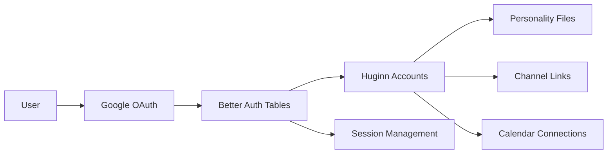
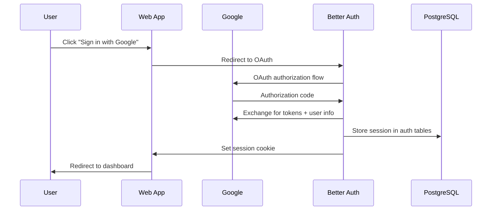

# Authentication Flow

Huginn uses **Better Auth** for OAuth session management but maintains its own `accounts` table for application data. This creates a **two-table auth system** linked by Google sub IDs.

## Auth Architecture

### Two Separate Account Systems

<Callout type="info">
  **Better Auth ≠ Huginn Accounts** — Two separate tables linked by Google sub ID. Always query
  Huginn's `accounts` table for application logic.
</Callout>



### Data Flow

1. **Better Auth** handles OAuth, sessions, and security
2. **Huginn** handles business logic, personality, and features
3. **Bridge:** `googleSub` field links the two systems

## Google OAuth Setup

### Better Auth Configuration

```typescript
// From apps/web/src/lib/auth.ts
import { betterAuth } from "better-auth";
import { drizzleAdapter } from "better-auth/adapters/drizzle";

export const auth = betterAuth({
  database: drizzleAdapter(db, {
    provider: "pg",
    schema: { user, session, account: authAccount, verification },
  }),
  socialProviders: {
    google: {
      clientId: process.env.GOOGLE_CLIENT_ID!,
      clientSecret: process.env.GOOGLE_CLIENT_SECRET!,
    },
  },
  // ... other config
});
```

### Drizzle Adapter Requirement

<Callout type="warn">
  The `schema` option is **required** for the Drizzle adapter or Better Auth can't find its tables.
  Must include all four table references.
</Callout>

### Environment Variables

| Variable               | Purpose                | Used By                      |
| ---------------------- | ---------------------- | ---------------------------- |
| `GOOGLE_CLIENT_ID`     | Google OAuth client ID | Better Auth + Calendar OAuth |
| `GOOGLE_CLIENT_SECRET` | Google OAuth secret    | Better Auth + Calendar OAuth |
| `BETTER_AUTH_SECRET`   | JWT signing secret     | Better Auth sessions         |

**Note:** Same Google OAuth app used for both authentication and calendar access, but with different scopes.

## Session Resolution Flow

### 1. User Signs In



### 2. Per-Request Account Resolution

```typescript
// From apps/web/src/lib/server-fns.ts
export async function resolveAuthenticatedAccount(): Promise<Account> {
  const headers = getRequestHeaders();
  const session = await auth.api.getSession({ headers });

  if (!session?.user?.id) {
    throw new Error("Not authenticated");
  }

  // Step 1: Better Auth user ID → Google sub ID
  const googleSub = await getGoogleSubForBaUser(db, session.user.id);
  if (!googleSub) {
    throw new Error("No Google account linked");
  }

  // Step 2: Google sub → Huginn account
  let account = await accountService.getAccountByGoogleSub(googleSub);

  // Step 3: Create account if first login
  if (!account) {
    account = await accountService.createAccount(googleSub, session.user.email, session.user.name);

    // Step 4: Seed default personality files
    await seedNewAccount(db, account.id);
  }

  return account;
}
```

### Bridge Query Implementation

```typescript
// From packages/shared/src/services/account-service.ts
export async function getGoogleSubForBaUser(
  db: Database,
  baUserId: string,
): Promise<string | null> {
  const row = await db.query.authAccount.findFirst({
    where: and(eq(authAccount.userId, baUserId), eq(authAccount.providerId, "google")),
  });
  return row?.accountId ?? null; // Google sub ID
}
```

## Account Creation & Seeding

### New Account Flow

When a user logs in for the first time:

1. **Better Auth** creates session tables (`user`, `session`, `account`)
2. **Account resolution** detects missing Huginn account
3. **Create Huginn account** with Google email/name
4. **Seed personality files** with default SOUL.md and IDENTITY.md

```typescript
// From packages/shared/src/services/account-service.ts (simplified)
async createAccount(googleSub: string, email: string, displayName?: string) {
    const [row] = await db
        .insert(accounts)
        .values({ googleSub, email, displayName: displayName ?? null })
        .returning();
    return toAccount(row);
}

// From apps/web/src/lib/server-fns.ts
export async function seedNewAccount(db: Database, accountId: string) {
    const store = createPersonalityStore(db);

    await store.save(accountId, "SOUL", DEFAULT_SOUL_CONTENT, "Initial seed");
    await store.save(accountId, "IDENTITY", DEFAULT_IDENTITY_CONTENT, "Initial seed");
}
```

## Session Management

### Client-Side Auth

```typescript
// From apps/web/src/lib/auth-client.ts
import { createAuthClient } from "better-auth/react";

export const authClient = createAuthClient({
  baseURL: process.env.NODE_ENV === "production" ? process.env.APP_URL : "http://localhost:3000",
});

export const { useSession, signIn, signOut } = authClient;
```

### Server-Side Session Access

```typescript
// In TanStack Start server functions
import { getRequestHeaders } from "@tanstack/react-start/server";

export const serverFn = createServerFn({ method: "POST" })
  .validator(/* ... */)
  .handler(async ({ data }) => {
    const headers = getRequestHeaders(); // TanStack Start pattern
    const session = await auth.api.getSession({ headers });

    if (!session?.user?.id) {
      throw new Error("Not authenticated");
    }

    // Use resolveAuthenticatedAccount() helper...
  });
```

## API Routes vs TanStack Routes

<Callout type="warn">
  Better Auth API must be served via **Nitro server routes**, not TanStack Router routes, because it
  needs to handle OAuth callbacks and set cookies.
</Callout>

### Better Auth API Route

```typescript
// apps/web/server/api/auth/[...].ts (Nitro catch-all route)
import { auth } from "~/lib/auth";

export default defineEventHandler(async (event) => {
  return auth.handler(toWebRequest(event));
});
```

This serves all Better Auth endpoints:

- `/api/auth/signin/google`
- `/api/auth/callback/google`
- `/api/auth/session`
- `/api/auth/signout`

## Security Considerations

### Session Security

- **HttpOnly cookies** for session storage (Better Auth default)
- **CSRF protection** built into Better Auth
- **JWT signing** with `BETTER_AUTH_SECRET`

### Account Isolation

- Each request resolves to exactly one `accountId`
- Agent RequestContext scoped per account
- Calendar connections, personality files, channel links all FK to `accounts.id`

### OAuth Scope Separation

- **Auth scope:** `email`, `profile` (Better Auth)
- **Calendar scope:** `https://www.googleapis.com/auth/calendar.readonly` (separate OAuth flow)

## Development Notes

### Environment Setup

```bash
# Required for local auth
GOOGLE_CLIENT_ID=...
GOOGLE_CLIENT_SECRET=...
BETTER_AUTH_SECRET=...  # Generate with: openssl rand -base64 32

# Optional - auto-derived from RAILWAY_PUBLIC_DOMAIN on Railway
APP_URL=http://localhost:3000
```

### Common Gotchas

1. **Server-side env loading:** Nitro doesn't get Vite env vars — [`apps/web/src/lib/auth.ts`](file:///home/nate/Dungeon/Personal/huginn-second-brain/apps/web/src/lib/auth.ts) uses `dotenv` to load `.env` from monorepo root.

2. **Keep queries in shared:** Import `drizzle-orm` operators in apps causes duplicate instance conflicts in pnpm monorepos.

3. **Drizzle adapter schema:** Must pass `schema` object with all four auth table references or queries fail.

## Next Steps

- **[Memory Stack](/docs/architecture/memory-stack)** — How agent memory is scoped by `accountId`
- **[Calendar OAuth](/docs/patterns/calendar-oauth)** — Separate calendar OAuth implementation
- **[RequestContext Pattern](/docs/patterns/request-context)** — Per-request account injection in agents
