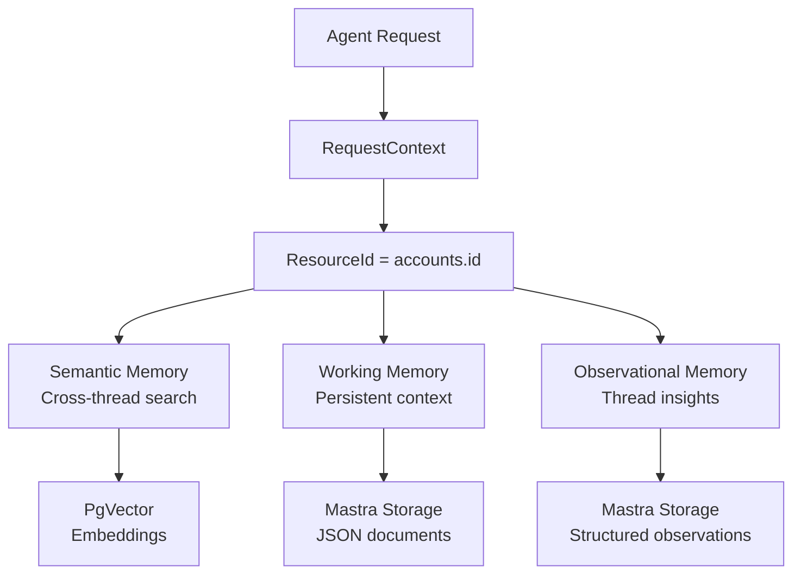

# Agent Memory Stack

Huginn's agent uses **Mastra's memory system** with three complementary layers designed for different recall patterns and scoping. All memory is unified by the **ResourceId** (`accounts.id`).

## Memory Architecture Overview



## Memory Layer Breakdown

### 1. Semantic Recall (Cross-Thread)

**Purpose:** Find relevant past conversations using vector similarity search  
**Scope:** `resource` (across all threads for this user)  
**Technology:** PgVector + OpenAI text-embedding-3-small

```typescript
// From apps/agent/src/mastra/agents/huginn.ts
semanticRecall: {
    topK: 3,              // Return top 3 most relevant messages
    messageRange: 2,       // Include 2 messages before/after each hit
    scope: "resource",     // Search across all user's threads
},
```

**Query Pattern:**

```typescript
// From apps/agent/src/workflows/daily-briefing.ts
const { messages } = await memory.recall({
  threadId: `briefing-lookup-${accountId}`, // Synthetic thread for lookup
  resourceId: accountId, // User scoping
  vectorSearchString: event.title, // What to search for
  threadConfig: {
    semanticRecall: {
      topK: 2,
      messageRange: 1,
      scope: "resource", // Cross-thread search
    },
  },
});
```

**Use Cases:**

- Daily briefing: "Find past conversations about today's meetings"
- Context injection: "Remember what the user said about this topic last week"
- Follow-up detection: "Did we discuss this project before?"

### 2. Working Memory (Resource-Scoped)

**Purpose:** Persistent context that survives across conversations  
**Scope:** `resource` (per-user, cross-thread)  
**Technology:** Mastra storage with structured JSON templates

```typescript
// From apps/agent/src/identity/instructions.ts
export const WORKING_MEMORY_TEMPLATE = `# Active Context

- Current focus/priority:
- Key deadlines:
- Active threads (waiting on X from Y):
- Temporary context (travel, PTO, etc.):
- Recent decisions and rationale:`;
```

**Agent Instructions:**

```text
## Working Memory Guidelines
- Update working memory when the user mentions priorities, deadlines, or
  things they're waiting on.
- Clear stale items when they're resolved or no longer relevant.
- Keep it concise — this is a scratchpad, not a journal.
```

**Use Cases:**

- **Project tracking:** "I'm waiting for feedback from John on the Q4 proposal"
- **Deadline awareness:** "Report due Friday, need data from Sarah"
- **Context switching:** "Currently in focus mode for product launch"
- **Travel/PTO:** "Out of office next week, limited availability"

### 3. Observational Memory (Thread-Scoped)

**Purpose:** Deep insights within individual conversations  
**Scope:** `thread` (conversation-specific)  
**Technology:** Gemini 2.5 Flash for observation/reflection generation

```typescript
// From apps/agent/src/mastra/agents/huginn.ts
observationalMemory: {
    model: "openrouter/google/gemini-2.5-flash",
    scope: "thread",
    observation: {
        messageTokens: 30_000,        // Observe after 30k tokens
        previousObserverTokens: 2_000, // Include 2k tokens from last observation
    },
    reflection: {
        observationTokens: 40_000,     // Reflect after 40k observation tokens
    },
},
```

**Automated Process:**

1. **Observation triggers** after conversation reaches 30k tokens
2. **Gemini analyzes** conversation patterns, decisions, preferences
3. **Reflection triggers** when observations total 40k tokens
4. **Higher-level insights** synthesized from multiple observations

**Use Cases:**

- **Conversation patterns:** "User prefers technical details over high-level summaries"
- **Decision tracking:** "User decided against Solution A due to cost concerns"
- **Context evolution:** "User's priorities shifted from speed to quality"
- **Communication style:** "User responds better to bullet points than paragraphs"

## Memory Scoping Strategy

### ResourceId = accounts.id

**All memory layers use the same `resourceId`** — the user's `accounts.id` UUID:

```typescript
// From apps/agent/src/mastra/agents/huginn.ts
export type HuginnContext = {
  "account-id": string;
  "personality-store": PersonalityStore;
  "calendar-service"?: CalendarService;
};

// Agent memory call
const response = await agent.generate([{ role: "user", content: prompt }], {
  requestContext: agentRequestContext,
  memory: {
    resource: accountId, // Scopes all memory layers
    thread: threadId, // Unique per conversation
  },
});
```

### Thread ID Conventions

| Channel      | Thread ID Format                 | Example                         |
| ------------ | -------------------------------- | ------------------------------- |
| **Web Chat** | `chat-${accountId}-${timestamp}` | `chat-123...abc-1704067200000`  |
| **Telegram** | `tg-chat-${chatId}`              | `tg-chat-987654321`             |
| **Workflow** | `briefing-${accountId}-${date}`  | `briefing-123...abc-2024-01-01` |

**Important:** Different thread IDs create separate observational memory scopes, but semantic recall searches across all threads for the same `resourceId`.

## Storage Implementation

### PostgresStore Configuration

```typescript
// From apps/agent/src/mastra/storage.ts
import { PostgresStore as MastraPostgresStore } from "@mastra/pg";

export const storage = new MastraPostgresStore({
  connectionString: process.env.DATABASE_URL!,
  schemaName: "mastra", // Isolated from application tables
});
```

**Schema Isolation Benefits:**

- **App code never queries `mastra.*` tables directly**
- **Mastra auto-migration** manages memory schema
- **Clean separation** between business logic and agent memory

### Vector Storage

```typescript
// From apps/agent/src/mastra/agents/huginn.ts
const vector = new PgVector({
  id: "huginn-vector",
  connectionString: process.env.DATABASE_URL!,
  // Uses public schema, auto-creates vector tables
});

const embedder = new ModelRouterEmbeddingModel({
  providerId: "openrouter",
  modelId: "openai/text-embedding-3-small",
});
```

**PgVector Integration:**

- **Same database** as application tables (different schema)
- **Auto-managed tables** for vector embeddings
- **OpenAI embeddings** for semantic similarity

## Memory Persistence Patterns

### Cross-Conversation Continuity

```typescript
// Working memory persists across conversations
const conversation1 = await agent.generate([...], {
    memory: { resource: "user123", thread: "chat-1" }
});
// User says: "I'm working on Q4 planning, deadline is Friday"

const conversation2 = await agent.generate([...], {
    memory: { resource: "user123", thread: "chat-2" } // Different thread
});
// Agent remembers: "I see you're still working on Q4 planning. How's it going with the Friday deadline?"
```

### Thread-Specific Insights

```typescript
// Observational memory scoped to thread
const longConversation = await agent.generate([...], {
    memory: { resource: "user123", thread: "planning-session-1" }
});
// After 30k tokens: Gemini observes user prefers detailed technical breakdowns in this planning context

const differentConversation = await agent.generate([...], {
    memory: { resource: "user123", thread: "casual-chat-1" }
});
// Fresh observational context, but same working memory and semantic recall
```

## Memory in Daily Briefing Workflow

### Semantic Context Injection

```typescript
// From apps/agent/src/workflows/daily-briefing.ts
for (const event of events) {
  const { messages } = await memory.recall({
    threadId: `briefing-lookup-${accountId}`,
    resourceId: accountId,
    vectorSearchString: event.title, // Search for past discussions about this meeting
    threadConfig: {
      semanticRecall: {
        topK: 2,
        messageRange: 1,
        scope: "resource", // Search across all past conversations
      },
    },
  });

  if (messages.length > 0) {
    contextSnippets.push(`Re: "${event.title}" — ${messages.join(" ... ")}`);
  }
}
```

**Result:** Daily briefings include context like:

> "Your 2pm meeting with Sarah is about the Q4 budget. You mentioned last week you wanted to discuss the marketing allocation increase."

## Development & Debugging

### Mastra Studio Memory View

```bash
# Start agent service
pnpm --filter @huginn/agent dev

# Start Mastra Studio (connects to agent API on port 4111)
pnpm --filter @huginn/agent dev:studio  # Opens on port 3001
```

**Studio Memory Features:**

- **Thread browsing** — See all conversation threads per resource
- **Working memory inspection** — Current persistent context per user
- **Observation timeline** — Automated insights and reflections
- **Semantic search** — Test vector queries against conversation history

### Memory Observability

```typescript
// From apps/agent/src/mastra/index.ts
observability: new Observability({
    configs: {
        default: {
            serviceName: "huginn",
            exporters: [new DefaultExporter()],
        },
    },
}),
```

**Trace Collection:** All memory operations traced and visible in Studio Observability tab.

## Performance Considerations

### Vector Search Optimization

- **Embedding cache:** PgVector handles embedding storage
- **Query limits:** `topK: 3` prevents overwhelming context
- **Message range:** `messageRange: 2` provides sufficient context without noise

### Working Memory Size

- **Template-driven:** Structured format prevents uncontrolled growth
- **Agent-managed:** LLM decides when to update vs clear items
- **Resource-scoped:** One working memory doc per user, not per thread

### Observational Memory Triggers

- **Conservative thresholds:** 30k/40k tokens prevent premature observations
- **Gemini efficiency:** Flash model for cost-effective insights
- **Thread isolation:** Observations don't pollute cross-thread context

## Next Steps

- **[RequestContext Pattern](/docs/patterns/request-context)** — How account-specific memory gets injected per request
- **[Daily Briefing Workflow](/docs/workflows/daily-briefing)** — Memory-powered morning briefings
- **[Calendar Integration](/docs/patterns/calendar-oauth)** — Context injection from calendar events
