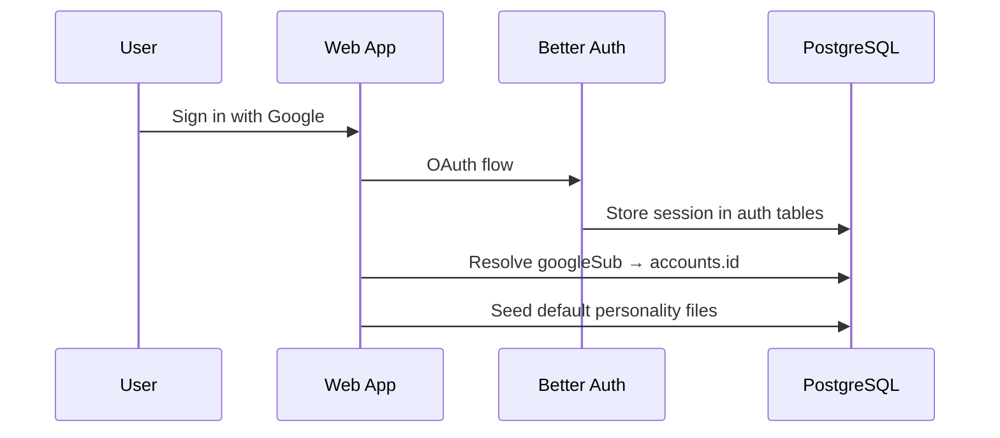
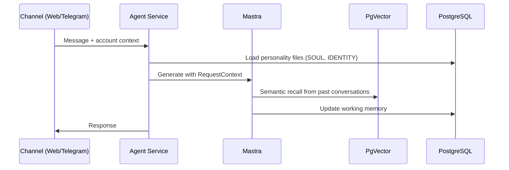

# System Architecture Overview

Huginn is a **personal AI assistant** built on a core principle: **one account → one personality → one memory → any channel**.

The system is designed as a Turborepo monorepo with clear separation between web frontend, agent backend, shared business logic, and documentation.

## Monorepo Structure

```
huginn/
├── apps/
│   ├── web/          # TanStack Start web dashboard (port 3000)
│   ├── agent/        # Mastra agent service + Telegram bot (port 4111)
│   ├── public-docs/  # Customer-facing Fumadocs site (port 5000)
│   └── private-docs/ # Internal engineering docs (port 5001)
└── packages/
    └── shared/       # Drizzle schemas, services, TypeScript interfaces
```

## Key Design Principles

### Single Database with Schema Isolation

**One PostgreSQL database, three logical schemas:**

- **`public` schema:** Application tables managed by Drizzle migrations
  - `accounts`, `channel_links`, `personality_files`, `linking_codes`, `calendar_connections`
  - Better Auth tables (`user`, `session`, `account`, `verification`)
  - PgVector embeddings tables (auto-managed)

- **`mastra` schema:** Agent memory managed by Mastra auto-migration
  - `threads`, `messages`, `working_memory`, `observations`, `reflections`

- **Bridge:** `accounts.id` (UUID) = Mastra `resourceId` — app code never queries `mastra.*` directly

### Agent-First Architecture

The [**apps/agent**](file:///home/nate/Dungeon/Personal/huginn-second-brain/apps/agent) package is the core intelligence:

- **Mastra Agent:** Claude Sonnet 4 via OpenRouter with dynamic personality injection
- **Memory System:** Semantic recall (PgVector), working memory (per-resource), observational memory (thread-scoped)
- **Tools:** Calendar lookup with server-side date math to prevent LLM hallucination
- **Workflows:** Daily briefing, future automation workflows

### Web Dashboard as Control Plane

The [**apps/web**](file:///home/nate/Dungeon/Personal/huginn-second-brain/apps/web) TanStack Start app provides:

- **Authentication:** Better Auth with Google OAuth (session → account resolution)
- **Unified Settings:** Tabbed interface consolidating personality, channels, calendars, and account management
  - **Personality tab:** CRUD for SOUL.md and IDENTITY.md files with versioning
  - **Channels tab:** Link/unlink Telegram accounts via QR codes  
  - **Calendars tab:** OAuth connections to Google Calendar with encrypted token storage
  - **Account tab:** User profile and session management

## Technology Stack

| Layer              | Technology                                                | Key Files                                                                                                                                 |
| ------------------ | --------------------------------------------------------- | ----------------------------------------------------------------------------------------------------------------------------------------- |
| **Web Frontend**   | TanStack Start + React 19 + Tailwind CSS v4               | [`apps/web/vite.config.ts`](file:///home/nate/Dungeon/Personal/huginn-second-brain/apps/web/vite.config.ts)                               |
| **Agent Backend**  | Mastra + Hono HTTP server + grammY Telegram bot           | [`apps/agent/src/index.ts`](file:///home/nate/Dungeon/Personal/huginn-second-brain/apps/agent/src/index.ts)                               |
| **Database**       | PostgreSQL with PgVector extension                        | [`packages/shared/drizzle.config.ts`](file:///home/nate/Dungeon/Personal/huginn-second-brain/packages/shared/drizzle.config.ts)           |
| **ORM**            | Drizzle ORM with schema isolation                         | [`packages/shared/src/schema/`](file:///home/nate/Dungeon/Personal/huginn-second-brain/packages/shared/src/schema)                        |
| **Authentication** | Better Auth + Google OAuth                                | [`apps/web/src/lib/auth.ts`](file:///home/nate/Dungeon/Personal/huginn-second-brain/apps/web/src/lib/auth.ts)                             |
| **AI/Memory**      | OpenRouter (Claude Sonnet 4, Gemini 2.5 Flash) + PgVector | [`apps/agent/src/mastra/agents/huginn.ts`](file:///home/nate/Dungeon/Personal/huginn-second-brain/apps/agent/src/mastra/agents/huginn.ts) |

## Data Flow

### 1. User Authentication



### 2. Agent Conversation



## Request Context Pattern

Critical for per-request dependency injection in the agent:

```typescript
// From apps/agent/src/mastra/agents/huginn.ts
export type HuginnContext = {
  "account-id": string;
  "personality-store": PersonalityStore;
  "calendar-service"?: CalendarService;
};

// Dynamic instructions based on context
instructions: async ({ requestContext }) => {
  const accountId = requestContext?.get("account-id") as string;
  const store = requestContext?.get("personality-store") as PersonalityStore;
  return buildInstructions(accountId, store, calendarService);
};
```

This ensures each agent request has isolated access to the correct user's personality and calendar data.

## Next Steps

- **[Data Model](/docs/architecture/data-model)** — Database schema and relationships
- **[Authentication Flow](/docs/architecture/auth-flow)** — Better Auth → Huginn account bridge
- **[Memory Stack](/docs/architecture/memory-stack)** — Agent memory architecture details
