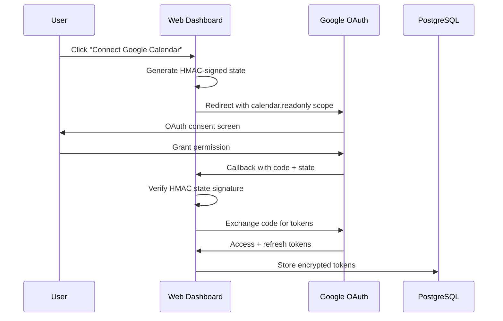

# Calendar OAuth Pattern

Huginn implements **separate OAuth flows** for authentication vs calendar access. This allows users to connect multiple Google calendars while using the same OAuth app configuration.

## Architecture Overview



## HMAC State Signing

### State Parameter Security

**Problem:** OAuth state parameter prevents CSRF but needs integrity protection.
**Solution:** HMAC-SHA256 with `BETTER_AUTH_SECRET` and expiry.

```typescript
// From apps/web/server/api/calendar/oauth.ts
import { createHmac, timingSafeEqual } from "node:crypto";

interface OAuthState {
  accountId: string;
  provider: string;
  timestamp: number;
}

function signOAuthState(state: OAuthState): string {
  const payload = JSON.stringify(state);
  const hmac = createHmac("sha256", process.env.BETTER_AUTH_SECRET!);
  hmac.update(payload);
  const signature = hmac.digest("base64url");

  return `${Buffer.from(payload).toString("base64url")}.${signature}`;
}

function verifyOAuthState(signedState: string): OAuthState {
  const [payloadB64, signature] = signedState.split(".");
  if (!payloadB64 || !signature) {
    throw new Error("Invalid state format");
  }

  const payload = Buffer.from(payloadB64, "base64url").toString();
  const state: OAuthState = JSON.parse(payload);

  // Check expiry (10 minutes)
  if (Date.now() - state.timestamp > 10 * 60 * 1000) {
    throw new Error("OAuth state expired");
  }

  // Verify HMAC signature
  const expectedHmac = createHmac("sha256", process.env.BETTER_AUTH_SECRET!);
  expectedHmac.update(payload);
  const expectedSignature = expectedHmac.digest("base64url");

  if (!timingSafeEqual(Buffer.from(signature), Buffer.from(expectedSignature))) {
    throw new Error("Invalid state signature");
  }

  return state;
}
```

## OAuth Flow Implementation

### Initiate OAuth (Web Dashboard)

```typescript
// From apps/web/src/components/calendars-page.tsx
async function connectGoogleCalendar() {
  const account = await getCurrentAccount();

  // Call server function to get OAuth URL
  const oauthUrl = await initiateCalendarOAuth({
    provider: "google",
    accountId: account.id,
  });

  // Redirect to Google OAuth
  window.location.href = oauthUrl;
}
```

### Generate OAuth URL (Nitro Server Route)

```typescript
// From apps/web/server/api/calendar/oauth.ts
export default defineEventHandler(async (event) => {
  const { provider, accountId } = await readBody(event);

  if (provider !== "google") {
    throw new Error("Only Google Calendar supported");
  }

  // Create signed state parameter
  const state = signOAuthState({
    accountId,
    provider,
    timestamp: Date.now(),
  });

  const params = new URLSearchParams({
    client_id: process.env.GOOGLE_CLIENT_ID!,
    redirect_uri: `${getBaseURL()}/api/calendar/callback`,
    scope: "https://www.googleapis.com/auth/calendar.readonly", // Calendar only
    response_type: "code",
    access_type: "offline", // Get refresh token
    prompt: "consent", // Force refresh token
    state,
  });

  return {
    url: `https://accounts.google.com/o/oauth2/v2/auth?${params}`,
  };
});
```

### OAuth Callback Handler

```typescript
// From apps/web/server/api/calendar/callback.ts
import { redirect } from "h3"; // h3 v2 API

export default defineEventHandler(async (event) => {
  const { code, state, error } = getQuery(event);

  if (error) {
    console.error("OAuth error:", error);
    return redirect("/calendars?error=oauth_denied", 302);
  }

  if (!code || !state) {
    return redirect("/calendars?error=missing_params", 302);
  }

  try {
    // Verify and parse state
    const { accountId, provider } = verifyOAuthState(state as string);

    // Exchange authorization code for tokens
    const tokenResponse = await fetch("https://oauth2.googleapis.com/token", {
      method: "POST",
      headers: { "Content-Type": "application/x-www-form-urlencoded" },
      body: new URLSearchParams({
        client_id: process.env.GOOGLE_CLIENT_ID!,
        client_secret: process.env.GOOGLE_CLIENT_SECRET!,
        code: code as string,
        grant_type: "authorization_code",
        redirect_uri: `${getBaseURL()}/api/calendar/callback`,
      }),
    });

    const tokens = await tokenResponse.json();

    if (tokens.error) {
      throw new Error(`Token exchange failed: ${tokens.error}`);
    }

    // Get user info to identify the calendar account
    const userInfoResponse = await fetch("https://www.googleapis.com/oauth2/v2/userinfo", {
      headers: { Authorization: `Bearer ${tokens.access_token}` },
    });
    const userInfo = await userInfoResponse.json();

    // Store encrypted connection
    const connectionService = createCalendarConnectionService(db);
    await connectionService.createConnection({
      accountId,
      provider: "google",
      providerEmail: userInfo.email,
      displayName: userInfo.email,
      accessToken: tokens.access_token, // Auto-encrypted
      refreshToken: tokens.refresh_token, // Auto-encrypted
      tokenExpiresAt: new Date(Date.now() + tokens.expires_in * 1000),
    });

    return redirect("/calendars?success=connected", 302);
  } catch (err) {
    console.error("Calendar OAuth callback error:", err);
    return redirect("/calendars?error=callback_failed", 302);
  }
});
```

## Scope Separation Benefits

### Two Independent OAuth Flows

| Flow               | Scope               | Purpose           | Tokens Stored                       |
| ------------------ | ------------------- | ----------------- | ----------------------------------- |
| **Authentication** | `email`, `profile`  | Better Auth login | Better Auth tables                  |
| **Calendar**       | `calendar.readonly` | Calendar access   | Encrypted in `calendar_connections` |

**Benefits:**

1. **User can connect different Google accounts** for calendar vs login
2. **Granular permissions** — calendar access separate from identity
3. **Multiple calendar accounts** — connect work + personal calendars
4. **Independent token refresh** — calendar tokens don't affect login
5. **Easy revocation** — user can disconnect calendar without losing login

### Multi-Account Calendar Support

```typescript
// User can connect multiple Google accounts for calendar
await connectionService.createConnection({
  accountId: "huginn-user-123",
  provider: "google",
  providerEmail: "work@company.com", // Work calendar
  // ...
});

await connectionService.createConnection({
  accountId: "huginn-user-123", // Same Huginn account
  provider: "google",
  providerEmail: "personal@gmail.com", // Personal calendar
  // ...
});

// Calendar service automatically aggregates events from both
const events = await calendarService.getEvents("huginn-user-123", range);
// ^ Events from work@company.com AND personal@gmail.com
```

## Token Management

### Automatic Token Refresh

```typescript
// From packages/shared/src/services/calendar-service.ts
async function ensureFreshToken(
  connection: CalendarConnection,
  db: Database,
): Promise<CalendarConnection> {
  // 60s buffer before actual expiry
  if (connection.tokenExpiresAt.getTime() > Date.now() + 60_000) {
    return connection;
  }

  // Refresh via provider
  const provider = providers[connection.provider];
  const fresh = await provider.refreshTokens(connection);

  // Update encrypted tokens in database
  const svc = createCalendarConnectionService(db);
  await svc.updateTokens(
    connection.id,
    fresh.accessToken, // Auto-encrypted
    fresh.refreshToken, // Auto-encrypted
    fresh.expiresAt,
  );

  return {
    ...connection,
    accessToken: fresh.accessToken,
    refreshToken: fresh.refreshToken,
    tokenExpiresAt: fresh.expiresAt,
  };
}
```

### Connection Status Management

```typescript
// From packages/shared/src/schema/calendar-connections.ts
export const calendarConnections = pgTable("calendar_connections", {
  // ...
  enabled: boolean("enabled").notNull().default(true), // User can disable
});

// Users can disable without deleting (preserves tokens for re-enable)
await connectionService.setEnabled(connectionId, false);
```

## Error Handling

### OAuth Error Cases

```typescript
// OAuth consent denied
?error=access_denied
// → Redirect to calendars page with user-friendly message

// Invalid/expired authorization code
{ "error": "invalid_grant" }
// → Log error, redirect with error message

// Token refresh failure (refresh token expired/revoked)
{ "error": "invalid_grant" }
// → Mark connection as disabled, require re-authentication
```

### Graceful Degradation

```typescript
// From apps/agent/src/identity/instructions.ts
export async function buildInstructions(/*...*/) {
  let calendarBlock = "";
  if (calendarService) {
    try {
      const events = await calendarService.getEvents(accountId, range);
      calendarBlock = calendarService.formatForContext(events);
    } catch (err) {
      console.warn("[buildInstructions] Calendar fetch failed:", err);
      // Agent works without calendar context - no crash
    }
  }
  // ...
}
```

## Development Setup

### Google Cloud Console Configuration

```bash
# 1. Enable APIs
# - Google Calendar API
# - Google+ API (for userinfo)

# 2. OAuth 2.0 Client Configuration
# Application type: Web application
# Authorized redirect URIs:
#   - http://localhost:3000/api/auth/callback/google      (Better Auth)
#   - http://localhost:3000/api/calendar/callback         (Calendar OAuth)
#   - https://your-domain.com/api/auth/callback/google    (Production)
#   - https://your-domain.com/api/calendar/callback       (Production)
```

Environment Variables:

```bash
# Same OAuth app for both flows
GOOGLE_CLIENT_ID="..."
GOOGLE_CLIENT_SECRET="..."

# For HMAC state signing
BETTER_AUTH_SECRET="..."

# For token encryption
CALENDAR_ENCRYPTION_KEY="..."
```

## Future Enhancements

### Multi-Provider Support

```typescript
// Planned: Support additional calendar providers
interface CalendarProvider {
  getEvents(connection: CalendarConnection, range: DateRange): Promise<CalendarEvent[]>;
  refreshTokens(connection: CalendarConnection): Promise<TokenRefreshResult>;
  getOAuthUrl(accountId: string, baseURL: string): Promise<string>;
  handleCallback(code: string, state: string): Promise<CalendarConnection>;
}

// providers/outlook-calendar-provider.ts
// providers/apple-calendar-provider.ts
```

### Calendar Filtering

```typescript
// Planned: Filter by calendar visibility, response status
const events = await calendarService.getEvents(accountId, {
  start: range.start,
  end: range.end,
  filters: {
    includeDeclined: false, // Skip declined events
    calendarTypes: ["owner"], // Only calendars user owns
  },
});
```

## Next Steps

- **[Token Encryption](/docs/patterns/token-encryption)** — How OAuth tokens are secured
- **[CalendarService](/docs/services/calendar-service)** — API that uses these OAuth connections
- **[Authentication Flow](/docs/architecture/auth-flow)** — How Better Auth differs from calendar OAuth
