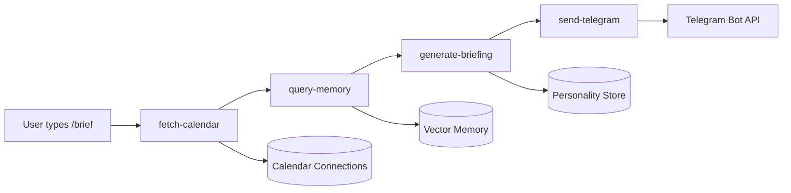

# Daily Briefing Workflow

The daily briefing is a **Mastra Workflow** that creates personalized morning briefings by combining calendar events, semantic memory, and personality context. Triggered on-demand via Telegram `/brief` command.

## Workflow Architecture



## Four-Step Pattern

### Step 1: fetch-calendar

**Purpose:** Load today's calendar events from all connected calendars

```typescript
// From apps/agent/src/workflows/daily-briefing.ts
const fetchCalendar = createStep({
  id: "fetch-calendar",
  inputSchema: z.object({
    accountId: z.string(),
    telegramChatId: z.string(),
  }),
  outputSchema: z.object({
    accountId: z.string(),
    telegramChatId: z.string(),
    events: z.array(/* CalendarEvent schema */),
    hasEvents: z.boolean(),
  }),
  execute: async ({ inputData, requestContext }) => {
    const { accountId, telegramChatId } = inputData;

    // Use injected calendar service
    const calendarService = requestContext!.get("calendar-service") as CalendarService;

    const now = new Date();
    const events = await calendarService.getEvents(accountId, {
      start: startOfDay(now),
      end: endOfDay(now),
    });

    return {
      accountId,
      telegramChatId,
      events: serializeEvents(events), // Convert Dates to ISO strings
      hasEvents: events.length > 0,
    };
  },
});
```

### Step 2: query-memory

**Purpose:** Find relevant context from past conversations for each calendar event

```typescript
const queryMemory = createStep({
  id: "query-memory",
  inputSchema: calendarOutputSchema,
  outputSchema: calendarOutputSchema.extend({
    memoryContext: z.array(z.string()),
  }),
  execute: async ({ inputData, mastra }) => {
    const { events, hasEvents } = inputData;

    if (!hasEvents) {
      return { ...inputData, memoryContext: [] };
    }

    const agent = mastra!.getAgent("huginn");
    const memory = await agent.getMemory();

    const contextSnippets: string[] = [];
    for (const event of events) {
      try {
        // Semantic search across all user's conversations
        const { messages } = await memory.recall({
          threadId: `briefing-lookup-${inputData.accountId}`, // Synthetic thread
          resourceId: inputData.accountId,
          vectorSearchString: event.title, // Search for event title
          threadConfig: {
            semanticRecall: {
              topK: 2, // Top 2 most relevant messages
              messageRange: 1, // Include 1 message before/after
              scope: "resource", // Search across all threads
            },
          },
        });

        if (messages.length > 0) {
          const snippets = messages
            .filter((m: { role: string }) => m.role === "user" || m.role === "assistant")
            .map((m: { content: unknown }) =>
              typeof m.content === "string" ? m.content : JSON.stringify(m.content),
            )
            .slice(0, 2)
            .join(" ... ");

          if (snippets) {
            contextSnippets.push(`Re: "${event.title}" — ${snippets}`);
          }
        }
      } catch (error) {
        console.warn(`Memory query failed for "${event.title}":`, error);
        // Continue with other events
      }
    }

    return { ...inputData, memoryContext: contextSnippets };
  },
});
```

### Step 3: generate-briefing

**Purpose:** Use agent with personality context to create personalized briefing

```typescript
const generateBriefing = createStep({
  id: "generate-briefing",
  inputSchema: memoryOutputSchema,
  outputSchema: z.object({
    accountId: z.string(),
    telegramChatId: z.string(),
    briefingText: z.string(),
  }),
  execute: async ({ inputData, mastra, requestContext }) => {
    const { accountId, events, hasEvents, memoryContext } = inputData;
    const agent = mastra!.getAgent("huginn");

    const today = new Date().toLocaleDateString("en-US", {
      weekday: "long",
      year: "numeric",
      month: "long",
      day: "numeric",
    });

    // Format calendar for prompt
    let formattedCalendar: string;
    if (!hasEvents) {
      formattedCalendar = "No meetings scheduled today — your calendar is clear.";
    } else {
      formattedCalendar = events
        .map((e) => {
          const start = new Date(e.start);
          const end = new Date(e.end);
          const timeStr = e.isAllDay
            ? "All day"
            : `${start.toLocaleTimeString("en-US", { hour: "numeric", minute: "2-digit" })} – ${end.toLocaleTimeString("en-US", { hour: "numeric", minute: "2-digit" })}`;
          const loc = e.location ? ` (${e.location})` : "";
          return `- ${timeStr}: ${e.title}${loc} [${e.source.connectionLabel}]`;
        })
        .join("\n");
    }

    const contextSection =
      memoryContext.length > 0 ? memoryContext.join("\n") : "No relevant context found.";

    const prompt = `Generate a morning briefing for today, ${today}.

## Today's Calendar
${formattedCalendar}

## Relevant Context from Past Conversations  
${contextSection}

## Instructions
- Keep it concise — this is a Telegram message
- Lead with the calendar overview
- Weave in any relevant memory context naturally
- End with a brief motivational note in your personality voice
- Use Markdown formatting compatible with Telegram
- Do NOT use headers or horizontal rules`;

    // Create agent request context with personality + calendar injection
    const agentRequestContext = new RequestContext();
    agentRequestContext.set("account-id", accountId);
    agentRequestContext.set(
      "personality-store",
      requestContext!.get("personality-store") as PersonalityStore,
    );
    agentRequestContext.set(
      "calendar-service",
      requestContext!.get("calendar-service") as CalendarService,
    );

    const dateStr = today.replace(/\s+/g, "-").toLowerCase();
    const response = await agent.generate([{ role: "user" as const, content: prompt }], {
      requestContext: agentRequestContext,
      memory: {
        resource: accountId,
        thread: `briefing-${accountId}-${dateStr}`, // Consistent thread ID
      },
    });

    return {
      accountId,
      telegramChatId: inputData.telegramChatId,
      briefingText: response.text,
    };
  },
});
```

### Step 4: send-telegram

**Purpose:** Deliver briefing via Telegram with Markdown formatting and error handling

```typescript
const sendTelegram = createStep({
  id: "send-telegram",
  inputSchema: z.object({
    accountId: z.string(),
    telegramChatId: z.string(),
    briefingText: z.string(),
  }),
  outputSchema: z.object({
    sent: z.boolean(),
    reason: z.string(),
  }),
  execute: async ({ inputData }) => {
    const { accountId, telegramChatId, briefingText } = inputData;

    // Dry run mode for testing
    const dryRun = process.env.DAILY_BRIEF_DRY_RUN === "true";
    if (dryRun) {
      console.log(`[daily-briefing] DRY RUN for account ${accountId}:\n${briefingText}`);
      return { sent: false, reason: "dry-run" };
    }

    const bot = getBot();
    if (!bot) {
      return { sent: false, reason: "bot-not-configured" };
    }

    try {
      // Try Markdown formatting first
      await bot.api.sendMessage(telegramChatId, briefingText, {
        parse_mode: "Markdown",
      });
      return { sent: true, reason: "delivered" };
    } catch (error) {
      console.error(`[daily-briefing] Telegram send failed for account ${accountId}:`, error);

      // Retry without Markdown if formatting was the issue
      if (error instanceof Error && error.message.includes("can't parse")) {
        try {
          await bot.api.sendMessage(telegramChatId, briefingText);
          return { sent: true, reason: "delivered-plain-text" };
        } catch (retryError) {
          console.error(`[daily-briefing] Plain text retry also failed:`, retryError);
        }
      }

      return {
        sent: false,
        reason: error instanceof Error ? error.message : "Unknown error",
      };
    }
  },
});
```

## Workflow Assembly

### Linear Step Chain

```typescript
// From apps/agent/src/workflows/daily-briefing.ts
export const dailyBriefingWorkflow = createWorkflow({
  id: "daily-briefing",
  inputSchema: z.object({
    accountId: z.string(),
    telegramChatId: z.string(),
  }),
  outputSchema: z.object({
    sent: z.boolean(),
    reason: z.string(),
  }),
})
  .then(fetchCalendar) // Step 1
  .then(queryMemory) // Step 2
  .then(generateBriefing) // Step 3
  .then(sendTelegram) // Step 4
  .commit();
```

## Triggering the Workflow

### Telegram /brief Command

```typescript
// From apps/agent/src/telegram/handlers.ts
async function handleBriefCommand(ctx: Context) {
  const telegramUserId = String(ctx.from.id);

  // Resolve Telegram user → Huginn account
  const account = await accountService.resolveAccountFromChannel("telegram", telegramUserId);

  if (!account) {
    await ctx.reply("Please link your account first with /link CODE");
    return;
  }

  await ctx.reply("🔄 Generating your daily briefing...");

  try {
    // Create workflow request context with services
    const requestContext = new RequestContext();
    requestContext.set("db", db);
    requestContext.set("account-service", accountService);
    requestContext.set("personality-store", createPersonalityStore(db));
    requestContext.set("calendar-service", createCalendarService(db));

    // Run workflow
    const result = await mastra.getWorkflow("daily-briefing").run(
      {
        accountId: account.id,
        telegramChatId: String(ctx.chat.id),
      },
      requestContext,
    );

    if (!result.sent) {
      await ctx.reply(`❌ Briefing failed: ${result.reason}`);
    }
    // Success message sent by workflow itself
  } catch (error) {
    console.error("[telegram] Daily briefing workflow failed:", error);
    await ctx.reply("❌ Something went wrong generating your briefing. Please try again later.");
  }
}
```

### Manual Testing

```typescript
// From terminal or test script
const { mastra } = require("./dist/mastra/index.js");
const { RequestContext } = require("@mastra/core/request-context");

const ctx = new RequestContext();
ctx.set("db", db);
ctx.set("calendar-service", createCalendarService(db));
ctx.set("personality-store", createPersonalityStore(db));

const result = await mastra.getWorkflow("daily-briefing").run(
  {
    accountId: "your-account-id",
    telegramChatId: "your-telegram-chat-id",
  },
  ctx,
);

console.log("Workflow result:", result);
```

## Example Output

### Sample Briefing

```markdown
**Good morning!** ☀️ Here's your Tuesday, January 16, 2024 briefing:

📅 **Today's Schedule:**

- 9:00–10:00 AM: Team standup (Conference Room A) [Work Calendar]
- 2:00–3:00 PM: Client demo for Q4 project [Work Calendar]
- 6:30 PM: Dinner with Sarah [Personal Calendar]

💡 **Context:**
Re: "Client demo for Q4 project" — Last week you mentioned wanting to highlight the new analytics dashboard and get feedback on the user flow.

Re: "Dinner with Sarah" — You were planning to discuss the vacation plans for March.

**You've got this!** 🚀 The demo prep you did yesterday should set you up perfectly for this afternoon. Have a productive day!
```

## Benefits of Workflow Pattern

### 1. Step Isolation

- Each step has single responsibility
- Easy to test, debug, and modify individual steps
- Clear input/output contracts via zod schemas

### 2. Observability

- **Mastra Studio** shows workflow execution trace
- Each step's duration and success/failure status
- Input/output data for each step visible for debugging

### 3. Error Handling

- Workflow continues if non-critical steps fail (memory query)
- Graceful degradation (briefing works without calendar context)
- Clear error messages returned to user

### 4. Reusability

- Steps can be reused in other workflows
- Same memory querying pattern for other features
- Calendar fetching reusable for other contexts

## Performance Optimizations

### Calendar Caching

```typescript
// From apps/agent/src/calendar-cache.ts
const CACHE_TTL = 5 * 60 * 1000; // 5 minutes

export function getCachedEvents(accountId: string): CalendarEvent[] | null {
  const key = `cal-${accountId}`;
  const cached = cache.get(key);
  return cached && Date.now() - cached.timestamp < CACHE_TTL ? cached.events : null;
}
```

**Benefits:**

- Avoids repeated Google Calendar API calls
- Briefings \<5min apart use cached data
- Respects API rate limits

### Memory Query Limits

```typescript
// Bounded memory search prevents overwhelming prompt
threadConfig: {
    semanticRecall: {
        topK: 2,           // Only top 2 most relevant messages
        messageRange: 1,   // 1 message before/after for context
        scope: "resource", // Search across threads but limit results
    },
}
```

## Future Enhancements

### Scheduled Briefings

```typescript
// Planned: Cron-triggered workflow execution
// Run daily briefings automatically for opted-in users
const scheduledBriefing = createWorkflow({
  id: "scheduled-daily-briefing",
  // Fetch all accounts with briefing enabled
  // Run briefing workflow for each
  // Handle time zone preferences
});
```

### Multi-Channel Support

```typescript
// Planned: Send briefings to multiple channels
const outputSchema = z.object({
  telegram: z.object({ sent: z.boolean(), chatId: z.string() }).optional(),
  email: z.object({ sent: z.boolean(), address: z.string() }).optional(),
  slack: z.object({ sent: z.boolean(), channelId: z.string() }).optional(),
});
```

### Smart Scheduling

```typescript
// Planned: Learn optimal briefing time per user
// Analyze when user typically checks messages
// Suggest best time for daily briefings
// Integrate with calendar free/busy data
```

## Next Steps

- **[Telegram Linking](/docs/workflows/telegram-linking)** — How accounts link to Telegram bots
- **[Memory Stack](/docs/architecture/memory-stack)** — How semantic recall works in workflows
- **[RequestContext Pattern](/docs/patterns/request-context)** — Dependency injection in workflows
